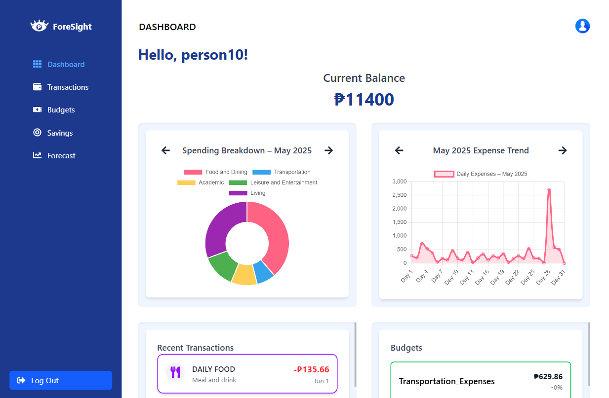
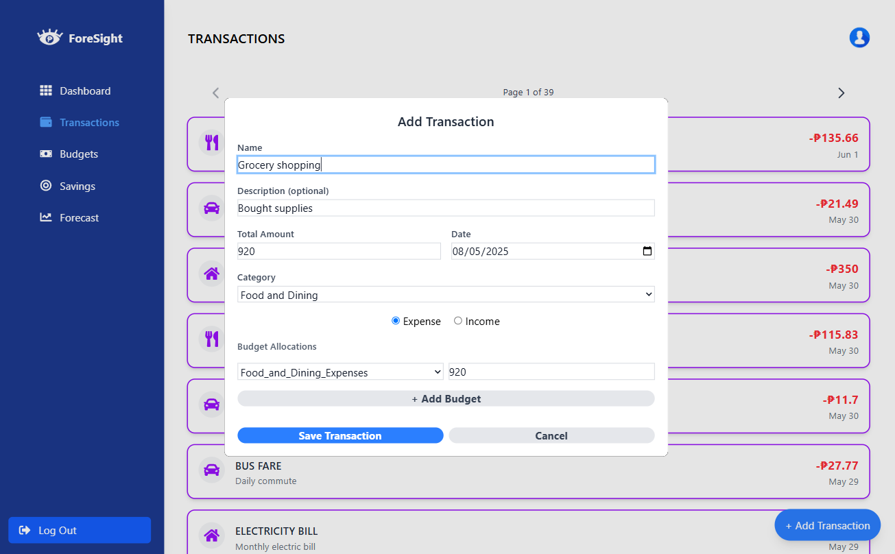
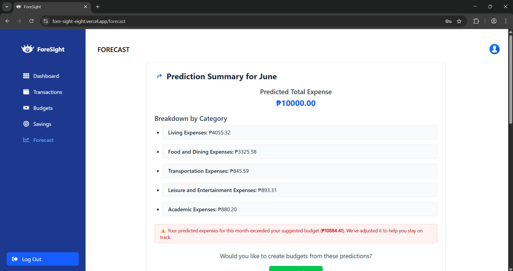

# 🔮 ForeSight
> *AI-Powered Financial Forecasting Web App for UPLB Students*

**Live Demo:** [https://fore-sight-eight.vercel.app/](https://fore-sight-eight.vercel.app/)

---

## 📘 Overview

**ForeSight** is an intelligent personal finance web application designed to help students predict, plan, and manage their expenses efficiently.  
Powered by **Random Forest** and **Exponential Smoothing** models, it provides data-driven insights and budget recommendations based on your past transactions.

This project is part of the research study:
> 🧠 *“ForeSight: A Random Forest - based tool for Expenditure Prediction and Personal Finance Management”*  
> by **John Kenneth Adolfo**

---

## 🚀 Features

- 💸 **Expense Forecasting** — Predicts next month’s expenses using Random Forest and Exponential Smoothing.  
- 📈 **Data Visualization Dashboard** — Interactive charts for comparing historical vs. predicted expenses.  
- 📊 **Category Analysis** — Breaks down forecasts into Food, Living, Transportation, Academic, and Leisure expenses.  
- 📂 **Transaction Upload** — Import multiple transactions at once via CSV.  
- 🔎 **Confidence-Based Budgeting** — Uses R²-weighted averaging to combine predictions from two models.  
- ⚡ **Real-Time Updates** — Fast and responsive frontend powered by React + Vite.

---

## ⚙️ Tech Stack

| Layer | Technology |
|-------|-------------|
| **Frontend** | React.js (Vite), Tailwind CSS |
| **Backend** | Node.js (Express) |
| **ML Model API** | FastAPI (Python, scikit-learn, pandas) |
| **Database** | MongoDB |
| **Visualization** | Charts.js |
| **Deployment** | Vercel (Frontend), Render/Railway (Backend) |

---

## 🧮 Prediction Workflow

1. **User Input** — Transaction data uploaded or added manually.  
2. **Backend Processing** — Data passed to FastAPI model API.  
3. **ML Forecast** — Random Forest predicts category expenses; Exponential Smoothing forecasts total expense.  
4. **Weighted Combination** — Confidence-weighted averaging merges both results.  
5. **Visualization** — Results displayed in charts on the Forecast page.

---

## 🖼️ Screenshots

| Dashboard | Transaction Page | Forecast Page |
|------------|----------------|------------------|
|  |  |  |

---

